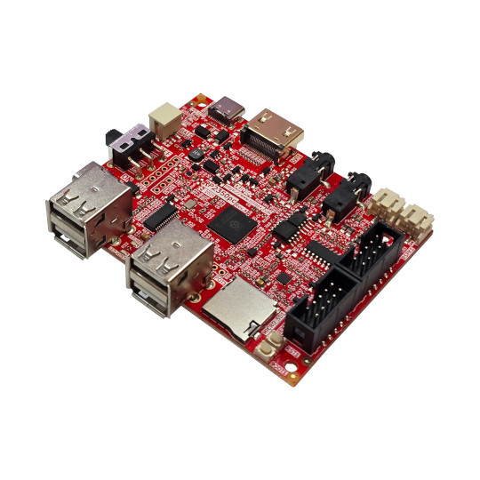

# RP2350pc
RP2350 all in one computer with 16MB Flash, 8MB PSRAM,  4 USB host, DVI/HDMI output, Stereo Audio codec and amplifier the ultimate RISC-V and Retro computer emulator

https://www.olimex.com/Products/RaspberryPi/PICO/RP2350pc/

## Licensee
* Hardware is released under CERN Open Hardware Licence Version 2 - Strongly Reciprocal
* Documentation is released under CC BY-SA 4.0